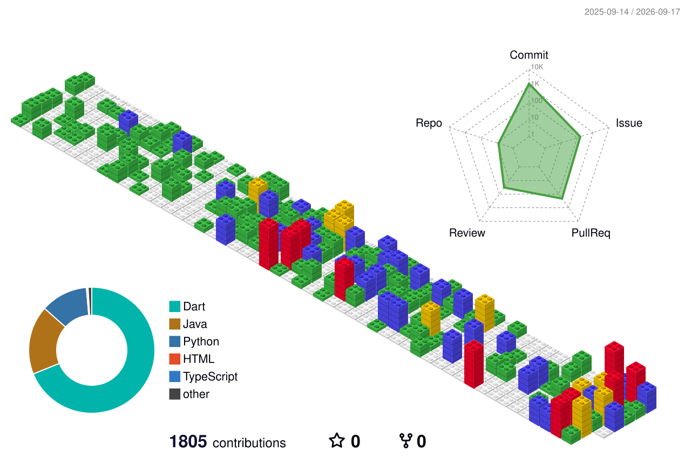

# 👋 Hi, I'm Seohyun Lee

### 안녕하세요, 프론트엔드 개발자 이서현입니다.

Frontend Developer focused on building reliable mobile and web experiences.
I mainly work with **Flutter/Dart**, and I also explore **Spring Boot, AI services, LLM/RAG, and computer vision**.

안정적이고 사용성 높은 모바일·웹 서비스를 만드는 프론트엔드 개발자입니다.
주로 **Flutter/Dart**를 활용하며, **Spring Boot, AI 서비스, LLM/RAG, Computer Vision** 분야에도 관심을 가지고 학습하고 있습니다.

I enjoy breaking down complex problems, reproducing issues precisely, and turning ideas into products that actually work.

복잡한 문제를 작은 단위로 나누고, 문제 상황을 정확히 재현한 뒤 실제 동작하는 서비스로 구현하는 과정을 좋아합니다.

---

## 🛠 Tech Stack

### Frontend

<p>
  
  
  
  
</p>

### Backend & Database

<p>
  
  
  
</p>

### Tools

<p>
  
  
  
  
</p>

---

## 📊 GitHub Contributions

<p align="center">
  
</p>
---

## 🚀 Featured Projects

| Project                                                   | Description                                     | Tech                                                                                                                                                                                                                                                                                                       | Links                                                                                                                                                                                                                                                                                                                                                                                                                                                                                                                                                                                                   |
| --------------------------------------------------------- | ----------------------------------------------- | ---------------------------------------------------------------------------------------------------------------------------------------------------------------------------------------------------------------------------------------------------------------------------------------------------------- | ------------------------------------------------------------------------------------------------------------------------------------------------------------------------------------------------------------------------------------------------------------------------------------------------------------------------------------------------------------------------------------------------------------------------------------------------------------------------------------------------------------------------------------------------------------------------------------------------------- |
| **[📱 RomRom](https://github.com/TEAM-ROMROM/RomRom-FE)** | 위치 기반 물물교환 및 실시간 채팅 모바일 서비스 |        | [](https://github.com/TEAM-ROMROM/RomRom-FE) [](https://apps.apple.com/kr/app/%ED%98%81%EC%8B%A0%EC%A0%81%EC%9D%B8-%EB%AC%BC%EB%AC%BC%EA%B5%90%ED%99%98-%EB%A1%AC%EB%A1%AC/id6748823976) [](https://play.google.com/store/apps/details?id=com.alom.romrom&hl=ko) |
| **[🌿 Chaerok](https://github.com/team-chaerok)**         | 충남 여행을 필름처럼 기록하는 위치 기반 여행 앱 |    | [](https://github.com/team-chaerok/chaerok-fe)                                                                                                                                                                                                                                                                                                                                                                                                                                               |
| **[🧠 AI Mart Guide](https://github.com/24-2-Capstone)**  | AI를 활용한 사용자 맞춤형 마트 쇼핑 가이드      |                                                                                                   | [](https://github.com/24-2-Capstone/Frontend)                                                                                                                                                                                                                                                                                                                                                                                                                                                |

### 🏆 Awards

- Excellence Award — 우수상
- Popularity Award — 인기상
- Encouragement Award — 장려상

`Flutter` `AI API` `Mobile`

---

## 🔎 Currently Exploring

### 현재 관심 분야

```text
Frontend Engineering
├── Flutter Architecture
│   └── Flutter 아키텍처 및 유지보수 가능한 구조
├── Mobile UX
│   └── 모바일 사용자 경험
├── Real-time Communication
│   └── 실시간 통신 및 상태 동기화
└── CI/CD
    └── 빌드·배포 자동화
```

---

## 📌 Development Approach

### 개발할 때 중요하게 생각하는 것

I care about more than simply making features work.
단순히 기능이 동작하는 것에서 끝나지 않고, 문제 해결 과정과 유지보수 가능한 구조를 중요하게 생각합니다.

- **Reproduce problems before fixing them**
  문제를 수정하기 전에 동일한 상황을 정확하게 재현합니다.

- **Break large problems into smaller flows**
  복잡한 문제를 작은 흐름과 단위로 나누어 접근합니다.

- **Keep UI and application logic maintainable**
  UI와 비즈니스 로직을 유지보수하기 쉬운 구조로 설계합니다.

- **Automate repetitive development workflows**
  반복되는 개발·배포 작업은 자동화합니다.

- **Validate implementations on real devices and realistic environments**
  실제 디바이스와 실제 서비스 환경에 가까운 조건에서 검증합니다.

- **Use AI tools to improve development productivity without losing technical understanding**
  기술에 대한 이해를 유지하면서 AI 도구를 활용해 개발 생산성을 높입니다.

---

## 📫 Contact

- GitHub: `https://github.com/SeoHyun1024`
- Email: `leesophy0805@gmail.com`
- Portfolio / Notion: `Coming Soon`

---

<p align="center">
  <b>Build clearly. Iterate relentlessly. Ship what matters.</b>
  <br/>
  명확하게 만들고, 끊임없이 개선하며, 가치 있는 결과를 완성합니다.
</p>
